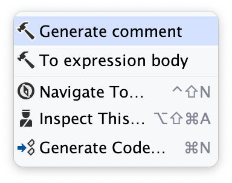
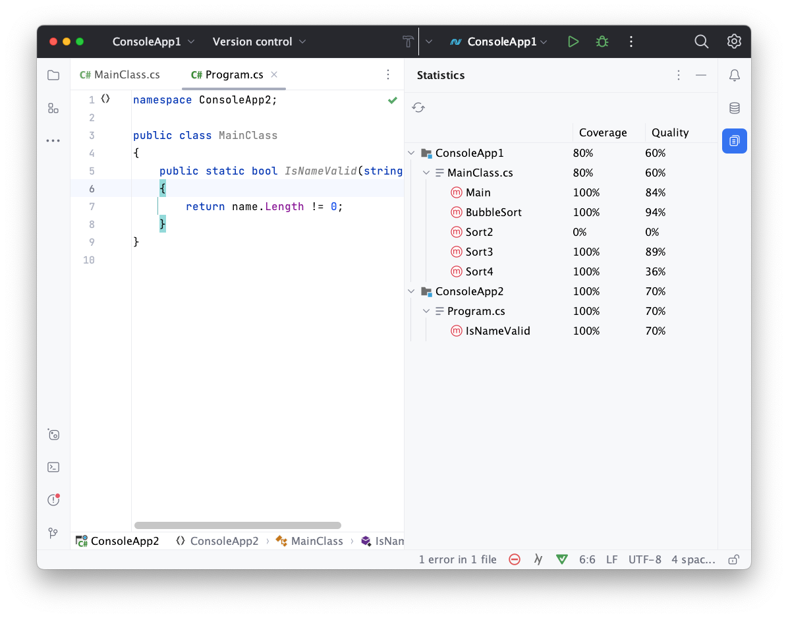

# CodeCommenter for Rider

The "CodeCommenter" plugin adds specific interactions with docstrings in [Rider](https://www.jetbrains.com/rider/).

Rider is JetBrains' cross platform .NET IDE, based on ReSharper and the IntelliJ Platform. The plugin adds:
- Context action to generate docstring using ML.
- Statistics Tool Window for viewing statistics about docstrings in your solution.

Make sure that you have a stable internet connection, because ML Model located on a separate server.

## Installation

Download and install this plugin from [JetBrains Marketplace](https://plugins.jetbrains.com/). *Not available yet.*

## Features

### Generate comment Context Action

The plugin can generate docstring for your method using Machine Learning. To do this cause the "Generate comment" Context Action and wait a bit.

### Statistics Tool Window

The plugin can display statistics about docstring *coverage* and *quality* in your solution. To do this open Tool Window with name "Statistics".

## Contact

Send me a message in Telegram: [@vakosta](https://t.me/vakosta).

Or E-mail: [v.annkv@ya.ru](mailto:v.annkv@ya.ru).
